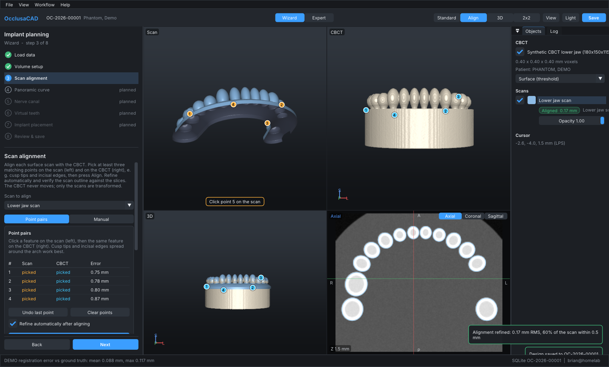
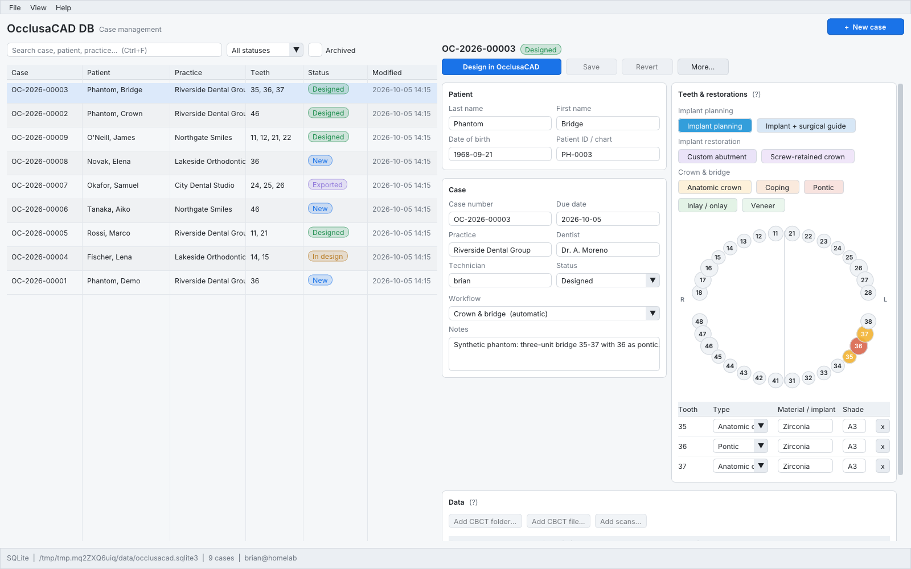
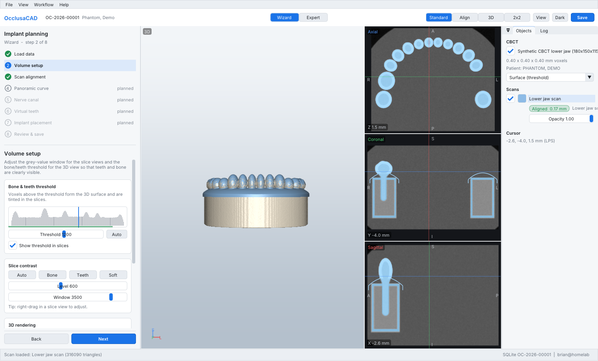
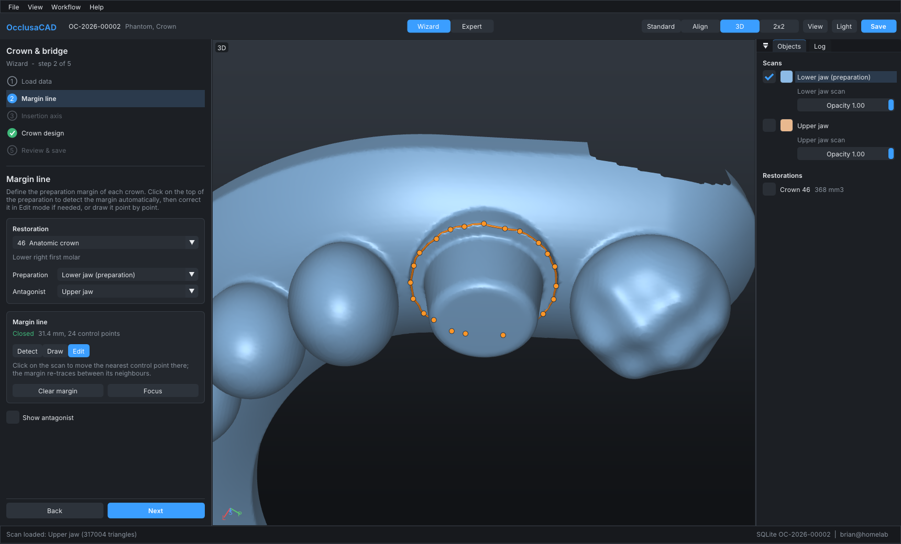
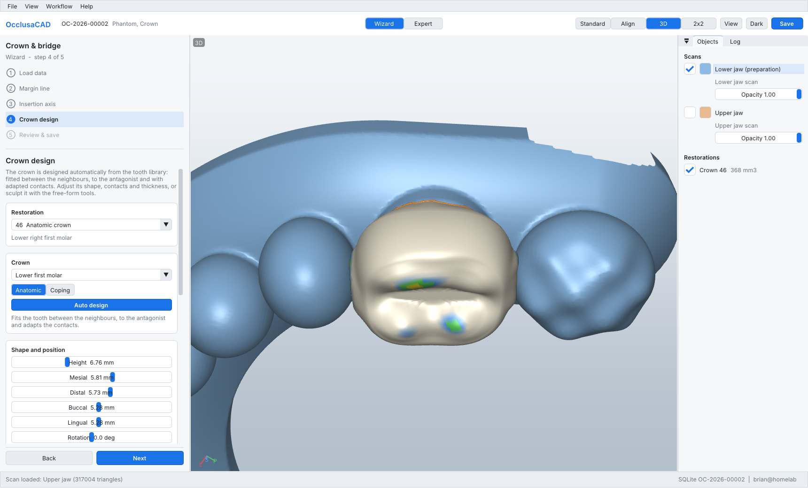
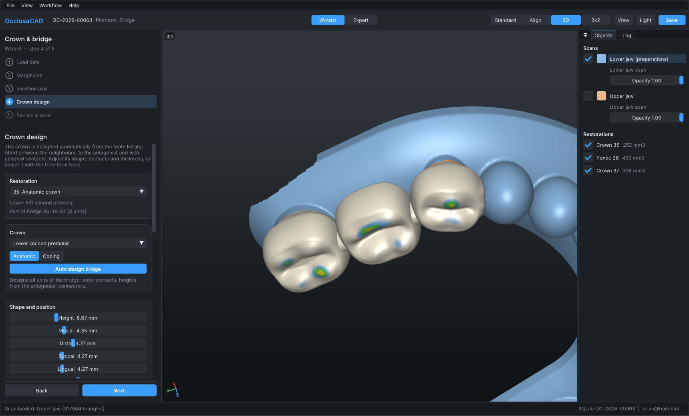

# OcclusaCAD

OcclusaCAD is a cross-platform dental CAD suite written in C++20. This repository holds the MVP:

| Executable | Role | Inspired by |
|---|---|---|
| **OcclusaCAD DB** (`OcclusaCADDB`) | Case management: patient and case details, restoration selection on a tooth chart, data attachment (CBCT, scans), launching the designer | exocad DentalDB |
| **OcclusaCAD** (`OcclusaCAD`) | Design application: implant planning (modelled on 3Shape Implant Studio) and crown & bridge (crowns, copings and bridges), with ideas from exocad | 3Shape Implant Studio, exocad DentalCAD |

Both run on **Windows, macOS and Linux** and support **light and dark mode** (following the OS setting, or chosen manually).



| OcclusaCAD DB (light) | OcclusaCAD – volume setup (light) |
|---|---|
|  |  |
| **Crown & bridge – margin line (dark)** | **Crown & bridge – crown design (light)** |
|  |  |



*All screenshots use the bundled synthetic phantom (see [Try it](#try-it-with-the-synthetic-phantom)); no patient data.*

## MVP features

**OcclusaCAD DB**
- Case list with search, status filter and archive. The list refreshes automatically, so changes from other workstations show up.
- Case editor: patient, practice and dentist, due date, technician, status and notes.
- Interactive FDI tooth chart (or Universal numbering) for assigning restoration types: implant planning, implant + surgical guide, custom abutment, crowns, pontics and others. The workflow is derived from the restorations automatically and can be overridden.
- Attaching data: CBCT (DICOM folder or file, validated on import) and surface scans (STL), copied into the case folder.
- **Design in OcclusaCAD** saves the case and launches the designer on it.
- Case locks show which workstation has a case open. Optimistic concurrency stops one workstation from silently overwriting another's changes.

**OcclusaCAD**
- **Wizard mode** (the default) walks through the case's workflow step by step, with Back/Next and a reason shown whenever a step can't be completed yet.
- **Expert mode** (`Ctrl+E`) can open any tool directly, including tools from other workflows.
- **DICOM loading**: series discovery in folders (or a single multi-frame file), slice sorting by position, oblique and gantry-tilted geometry, rescale slope/intercept, and enhanced multi-frame functional groups. Supported encodings: implicit/explicit little endian, explicit big endian, RLE Lossless, and JPEG Lossless (process 14 / SV1).
- **STL loading**: binary and ASCII, vertex welding, normals.
- **Rendering** (OpenGL 3.3 core):
  - CBCT as a GPU ray-cast surface at a threshold, X-ray MIP or direct volume rendering, with a crop box.
  - Axial, coronal and sagittal MPR views with crosshairs, window/level, a threshold tint, and the value under the mouse.
  - Scans rendered with MSAA and correct depth compositing against the volume.
- **Scan → CBCT registration**:
  - Point pairs picked in side-by-side scan and CBCT views, solved with Horn's closed form.
  - Automatic **ICP refinement**: coarse-to-fine, point-to-plane, trimmed, so gingiva is rejected. It runs against a CBCT iso-surface extracted only around the scan.
  - **Manual** adjustment with a 3D gizmo or millimetre/degree nudges, plus undo and reset.
  - Verification by scan outlines overlaid on the slices, plus surface-distance statistics.

  **The CBCT is never transformed**: world space is the DICOM patient coordinate system (LPS, mm) and only the scans carry a transform.
- **Crown & bridge** (crowns, copings and bridges on tooth preparations; no CBCT needed):
  - **Margin line**: click on the preparation and the margin is detected automatically all the way round, following the convex edge of the chamfer or shoulder. It can be corrected by moving control points, or drawn point by point; segments always follow the preparation edge.
  - **Insertion axis**: optimised automatically to minimise undercuts, shown as a colour map on the die. It can be tilted by hand or taken from the view direction.
  - **Crown design**: anatomy from an in-house parametric tooth library (incisors to molars, upper and lower). The crown is fitted between the neighbours and to the antagonist, then its proximal and occlusal contacts are adapted to target distances. Shape and position sliders, a contact distance map, and add/remove/smooth free-form tools with undo.
  - **Intaglio**: cement gap with a configurable distance to the margin, extra gap above, and undercuts blocked out along the insertion axis. Minimum and margin thickness are enforced.
  - The result is a **closed, watertight solid**. Its inner surface is the offset preparation and its outer shell starts exactly at the margin.
  - **Bridges** are recognised from the case: adjacent abutments (crowns, copings) and pontics form one bridge, including cantilevers.
    - All abutments share one **common insertion axis**, optimised over all of their dies. The divergence from each abutment's own best axis is shown.
    - **Pontics** are placed between the abutments by tooth width. Their basal surface follows the ridge, with an adjustable ridge contact (ovate when pressed in).
    - **Connectors** are elliptical, with a minimum cross-section area (default 9 mm², zirconia posterior), a height/width ratio and an embrasure clearance. A warning appears when a connector does not fit between the gingiva and the marginal ridges.
    - **Each connector can be moved and resized**: select it in the list or click it in the 3D view, then drag the gizmo or use the sliders (area, height/width, length, occlusal/gingival, bucco-lingual and mesio-distal offset). Edits are relative to the automatic placement, so they survive changes to the units. They are checked against the embrasure and the marginal ridges, can be undone or reset, and are saved with the design.
    - The units are **merged into one watertight solid** with the Manifold boolean library. Nothing is allowed to reach into a preparation's space. The merged bridge reports the measured cross-section of every connector.
- **Save**: the design state goes into the case database. Crowns and merged bridges (`bridge_35-36-37.stl`) are exported as STL to the case's `design/` folder in the coordinates of their scan; aligned scans in CBCT coordinates. Files opened from outside the case are copied into it.
- Planned tools appear in the workflow as placeholders: panoramic curve, nerve canal, virtual teeth, implant placement, sleeves, guide design and abutment design. Inlays/onlays and veneers are listed in the case but not designed yet.

**Case database**
- SQLite on a local disk or a **network share** (tuned for it: rollback journal instead of WAL, `BEGIN IMMEDIATE`, busy timeout). Paths are stored relative to the case folder, so different drive letters and mount points work.
- A repository interface with a **cloud backend stub** (`CloudCaseRepository`, TODOs describe the planned REST, object storage and OAuth design).

## Building

Requirements: CMake ≥ 3.21 and a C++20 compiler with `<format>` (GCC 13+, Clang 17+, Visual Studio 2022, Xcode 15+ / macOS 13.3+). All other dependencies are vendored in `third_party/`, so the build needs no network access.

```bash
cmake -S . -B build -DCMAKE_BUILD_TYPE=Release
cmake --build build --parallel
ctest --test-dir build --output-on-failure
```

Executables land in `build/bin/` (`build/bin/<Config>/` with Visual Studio). OcclusaCAD DB looks for `OcclusaCAD` next to itself.

**Linux packages** (Debian/Ubuntu names): `pkg-config libwayland-dev libxkbcommon-dev wayland-protocols xorg-dev libdbus-1-dev libgl-dev libegl-dev`. File dialogs use the XDG desktop portal over D-Bus, so GTK is not needed.

**Windows**: open the folder in Visual Studio 2022 (CMake project), or use the commands above from a Developer Prompt.

**macOS**: Xcode command line tools. OpenGL is deprecated on macOS but supported through 4.1 core; see [docs/ARCHITECTURE.md](docs/ARCHITECTURE.md#rendering) for the renderer plan.

## Running

1. Start **OcclusaCAD DB**. On first run it asks for the **data folder**, which holds `occlusacad.sqlite3` plus a `cases/` directory. For a lab, use a folder on a network share that every workstation can reach.
2. Create a case, select teeth and restoration types, then add the CBCT folder and the scans.
3. Click **Design in OcclusaCAD**. The designer opens the case in wizard mode: *Load data → Volume setup → Scan alignment → … → Review & save*.

Settings are stored per user in `%APPDATA%\OcclusaCAD\config.json`, `~/Library/Application Support/OcclusaCAD/config.json` or `~/.config/occlusacad/config.json`. Logs go to a `logs/` folder next to it.

### Command line

```
OcclusaCADDB [--config <file>] [--data-root <dir>] [--theme system|light|dark] [--select <case-uuid>|first|new]
OcclusaCAD   [--case <uuid>] [--config <file>] [--data-root <dir>] [--theme ...]
                [--dicom <dir|file>] [--scan <file.stl>] [<files...>]   # open data without a case
                [--step <step-key>] [--expert]
```

Environment overrides: `OCCLUSACAD_CONFIG` (config file path), `OCCLUSACAD_DATA_ROOT` (data folder).

### Mouse and keyboard (designer)

| | 3D views | Slice views |
|---|---|---|
| Left drag | rotate | move crosshair |
| Right drag | pan | window / level |
| Middle drag | pan | pan |
| Wheel | zoom at cursor | next/previous slice (Shift ×5), Ctrl+wheel zoom |
| Left click | pick point (alignment, margin, free-form) | set crosshair |

`F` fits all views, `Ctrl+E` toggles wizard/expert, `Ctrl+S` saves and `F1` shows help.

## Try it with the synthetic phantom

`occlusa_phantom` builds a CBCT-like lower jaw (bone, teeth with enamel, and a missing 36 as the implant site). It also writes an intraoral-style scan in its own scanner coordinates, plus the ground-truth transform.

For crown & bridge it writes `crown/`:
- a lower-jaw scan with shoulder preparations on 46 (single crown) and on 35 and 37, with 36 missing (bridge);
- the upper jaw in occlusion as the antagonist;
- the analytic margin lines (`crown_truth.json`, `bridge_truth.json`).

With `--create-case` the data sets become cases: "Phantom, Demo" (implant planning), "Phantom, Crown" (crown on 46) and "Phantom, Bridge" (bridge 35-36-37).

```bash
build/bin/occlusa_phantom --out /tmp/phantom --create-case /tmp/occlusacad-data     # also creates demo cases
build/bin/OcclusaCADDB --data-root /tmp/occlusacad-data
# or open the files directly:
build/bin/OcclusaCAD --dicom /tmp/phantom/dicom --scan /tmp/phantom/lower_scan.stl
```

### Headless checks (Linux)

Both apps can render off-screen through EGL (Mesa) and save a PNG. That is how the screenshots above were made and how the end-to-end test runs:

```bash
build/bin/OcclusaCAD --dicom /tmp/phantom/dicom --scan /tmp/phantom/lower_scan.stl \
    --demo-align /tmp/phantom/ground_truth.json --demo-max-error 0.25 --screenshot out.png
cmake -S . -B build -DOCCLUSACAD_HEADLESS_TESTS=ON && ctest --test-dir build -R e2e
```

`--demo-align` simulates a technician picking four landmarks, with about 0.5 mm of noise. It then runs the full point-pair + ICP pipeline and reports the error against ground truth. On the phantom (0.4 mm voxels) that is about 0.09 mm mean and 0.12 mm max.

`--demo-crown <crown_truth.json>` (with `--case` of the crown case) clicks on the preparation and detects the margin, then sets the insertion axis, designs the crown automatically and saves it with `--demo-save`. It reports the margin error against the analytic margin: on the phantom (0.2 mm scan resolution) about 0.11 mm mean and 0.19 mm max. The insertion axis is within 0.5° of the preparation axis.

With `bridge_truth.json` and the bridge case, the demo does both abutments, then the common axis, the bridge design and the merge. It then enlarges and raises one connector and merges again. It fails unless the merged bridges are watertight and every connector meets its (edited) area.

```bash
build/bin/OcclusaCAD --data-root /tmp/occlusacad-data --case <crown case uuid> \
    --demo-crown /tmp/phantom/crown/crown_truth.json --demo-max-margin-error 0.3 --demo-save --screenshot crown.png
```

## Repository layout

```
src/core/         domain logic, no GUI: DICOM, STL, volume, iso-surface, kd-tree, BVH, registration, workflows, platform
src/core/crown/   crown & bridge: margin detection, die, insertion axis, tooth library, crown builder, bridges
src/db/           case database: repository interface, SQLite backend, local file store, cloud stub
src/gfx/          OpenGL renderer: camera, MSAA targets, mesh shading, volume ray casting, MPR slices
src/ui/           application shell (GLFW + Dear ImGui), light/dark themes, fonts, dialogs, widgets, tooth chart
src/apps/casedb/  OcclusaCAD DB
src/apps/designer/ OcclusaCAD (document, views, workflow steps)
tools/phantom/    synthetic test data generator
tests/            unit tests (doctest) and the headless end-to-end tests
third_party/      vendored dependencies (see third_party/README.md)
docs/             architecture notes and screenshots
```

## Licensing

OcclusaCAD is licensed under the GNU AGPL v3 (see `LICENSE`). Vendored dependencies all use permissive licenses: MIT, zlib, BSD-style, Apache-2.0, public domain and the SIL OFL for the font. See [third_party/README.md](third_party/README.md).

## Roadmap

See [docs/ARCHITECTURE.md](docs/ARCHITECTURE.md#roadmap). Next up: inlays/onlays and veneers, crowns on implants, panoramic curve, nerve tracing, an implant library and placement, then guide design. After that come the cloud backend, JPEG 2000 and JPEG-LS DICOM, and app bundles and installers.
